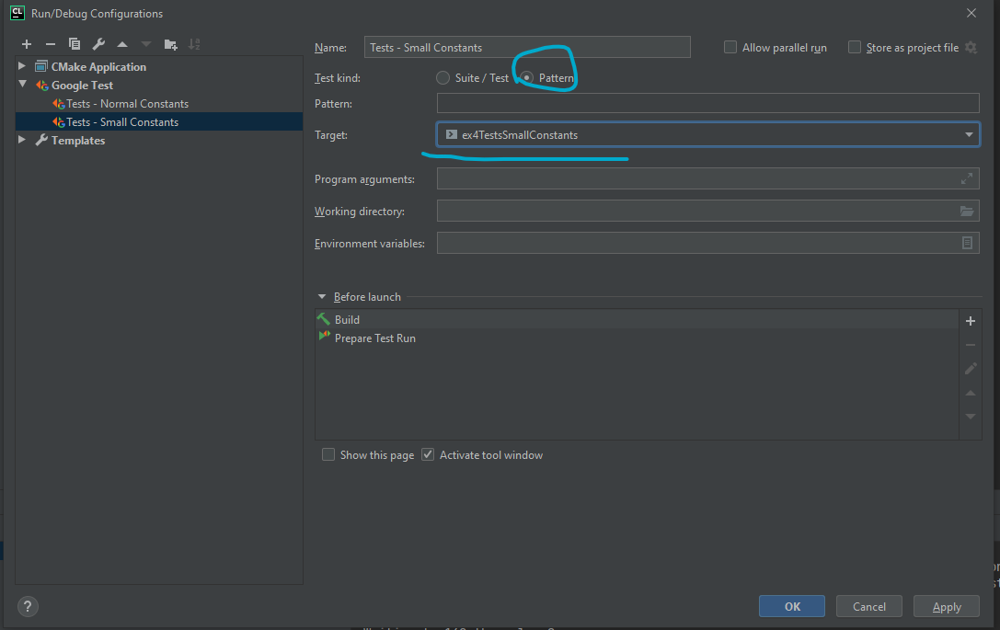
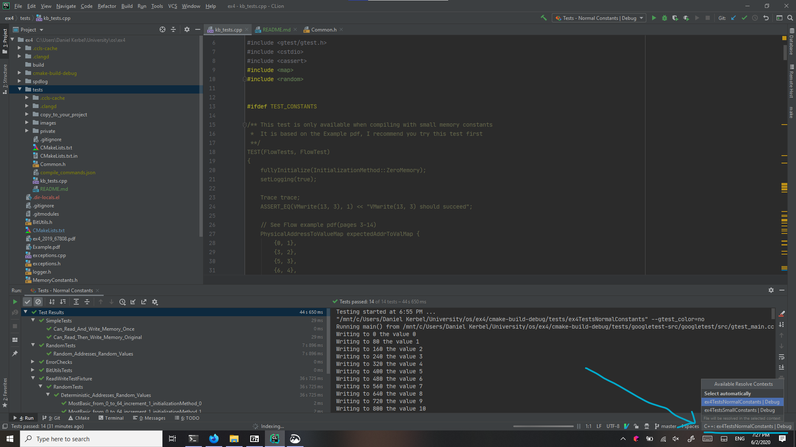

# Tests for OS Exercise 4, Exercise 2020 - Hierarchial page tables

## Requirements

These tests should work in Linux systems including the Aquarium, and on Windows with WSL2. (Which recently came out, I highly recommend you try it)

I haven't tested them on Mac or with normal Windows, and I have no idea if they work there. If you're having problems and you're sure you followed
the instructions, try them on the Aquarium.

## Installation instructions

1. From your project's root, perform `git clone https://github.cs.huji.ac.il/danielkerbel/tests_os_ex4.git tests`

2. Copy all files from `copy_to_your_project/` into your project's root directory.

   These include PhysicalMemory with some changes that allow the tests to track evict/restore operations,
   as well as an alternative set of memory constants, depending on preprocessor flag.
   
3. Use the following for `YOUR_PROJECT_ROOT/CMakeLists.txt`:
   ```cmake
   cmake_minimum_required(VERSION 3.1)
   
   
   
   # Project configuration
   project(ex4 VERSION 1.0 LANGUAGES C CXX)
   
   set(CMAKE_EXPORT_COMPILE_COMMANDS ON)
   
   # ------------- You may only modify the following section ----------- #
   set(vm_source_files
           VirtualMemory.h VirtualMemory.cpp
           PhysicalMemory.h PhysicalMemory.cpp
           MemoryConstants.h
   
           # add your own files here
           )
   
   set(vm_compile_options -Wall -Wextra -g -O2)
   
   
   # ------------ Do not modify anything below these lines ------------- #
   
   set(vm_link_libraries)
   
   set(vm_compile_definitions INC_TESTING_CODE)
   
   set(USE_SPEEDLOG OFF)
   
   if(USE_SPEEDLOG)
       add_subdirectory(spdlog)
       list(APPEND vm_link_libraries spdlog::spdlog)
       list(APPEND vm_compile_definitions USE_SPEEDLOG)
   endif()
   
   
   function(createVMTarget targetName define)
       add_library(${targetName} ${vm_source_files})
       set_property(TARGET ${targetName} PROPERTY CXX_STANDARD 11)
       target_compile_options(${targetName} PUBLIC ${vm_compile_options})
       target_link_libraries(${targetName} PUBLIC ${vm_link_libraries})
       target_compile_definitions(${targetName} PUBLIC ${vm_compile_definitions} ${define})
   endfunction()
   
   
   # ^^^^^^^^^^^^^^^^^^^^^^^^^^^^^^^^^^^^^^^^^^^^^^^^^^^^^^^^^^^^^^^
   # ---------------- You may modify the following -----------------
   # You can comment out some of these to speedup compilation,
   # but make sure you comment the corresponding lines in tests/CMakeLists.txt
   
   createVMTarget(VirtualMemory NORMAL_CONSTANTS)
   createVMTarget(TestVirtualMemory TEST_CONSTANTS)
   createVMTarget(OffsetDifferentThanIndexMemory OFFSET_DIFFERENT_FROM_INDEX)
   createVMTarget(SingleTableVirtualMemory SINGLE_TABLE_CONSTANTS)
   createVMTarget(UnreachableFramesVirtualMemory UNREACHABLE_FRAMES_CONSTANTS)
   createVMTarget(NoEvictionVirtualMemory NO_EVICTION_CONSTANTS)
   
   # ^^^^^^^^^^^^^^^^^^^^^^^^^^^^^^^^^^^^^^^^^^^^^^^^^^^^^^^^^^^^^^^
   
   # Add tests
   add_subdirectory(tests)
   
   ```
    You only have to modify `vm_source_files` and optionally `vm_compile_options`.
    
    
## A note about test executables

Firstly, you may have noticed that there are several library targets in the above CMakeLists, and several executable targets in the tests CMakeLists
Each one of them is compiled with different constants, yielding different page table hierarchies:

- The first executable, `ex4Tests_NormalConstants`, is linked with the library target `VirtualMemory`
  and uses the same constants in the default `MemoryConstants.h` provided in the exercise
  When compiling in this mode, the preprocessor variable `NORMAL_CONSTANTS` is defined.
  
- The second executable, `ex4Tests_SmallConstants`, is linked with the library target `TestVirtualMemory`
  and uses smaller constants that correspond to the example in the flow example PDF.
  When compiling in this mode, the preprocessor variable `TEST_CONSTANTS` is defined.
  
The tests file (`kb_tests.cpp`) uses `TEST_CONSTANTS` to determine whether to compile `FlowTest` or 
`Can_Read_And_Write_Memory_Once` - depending on which executable target is being compiled:

There are also a few other executables:

- `ex4Tests_OffsetDifferentThanIndex`: Virtual address width isn't divisble by offset width(so the first index is of different width)

- `ex4Tests_SingleTable`: contains a single page table

- `ex4Tests_UnreachableFrames`: Virtual memory size smaller than physical size, not all frames in RAM can be accessed

- `ex4Tests_NoEviction`: Virtual memory size == physical size, and no page tables,
  so there should never be an eviction(no space wasted on page tables)
  
  NOTE: I am not sure if this scenario should be supported, since it's quite an edge case.
  TODO: check this on forum. 


## What tests are there, what do they do?

- `Can_Read_And_Write_Memory_Once` is a very basic test, using the normal constants, it writes a value
  and then reads it, ensures the read value matches the written value, and then it checks the physical
  memory structure to ensure that the proper page tables were created.
  
  It only involves the second case for handling page faults(using max_frames_index + 1),
  and doesn't involve the first case(using a frame of zeros) or the third case(page eviction),
  so it's a good way to test the main logic of your address translation before handling page faults in
  more complex scenarios.
  

- `FlowTest` is the most detailed/interpretable test, it does the same operations as in the flow PDF, it checks
  that after each VMwrite/read operation, the gotten physical memory contents are equal to the expected ones.
  
  It even checks ensures that some of the `PMrestore` and `PMevict` functions were called
  
  Note, this test also relies on the assumption that PMrestore doesn't zero/modify the frame
  in case it was never evicted, if you're using the PhysicalMemory I provided(and this behaves the
  same like the one provided in the exercise), this shouldn't matter. If you decided to zero the
  frame in such cases (by modifying PhysicalMemory.cpp), then you should remove the lines containing
  `{14, 1337}` and `{15, 7331}`
  
  It also assumes that you don't manually clear the frame(content page) before it is restored, while
  technically doing so is not wrong, it is redundant, and for testing purposes I want to check as many
  cells as possible, therefore I also check cells that were just evicted.

There are also tests that are more-or-less independent from the constants:

- `Deterministic_Addresses_Random_Values` is a parameterized test - it is basically a template
  and there are various instantiations of this test with different parameters, see `TESTS_PARAMETERS`
  
  Note, not all parameters work when using small constants, in those cases, these tests will be skipped
  during runtime. In CLion, these will have green marks, in the terminal, it will say `SKIPPED` - that's
  not an error, but don't get confused if they later fail when running with normal constants.
  
-  `Can_Read_Then_Write_Memory_Original` is based on the SimpleTest provided in the example but with
   minor modifications.
   
   (It's also very similar to the one above)
   
- `Random_Addresses_Random_Values` is similar to the parameterized test, but instead of using increasing
  virtual addresses in a loop, it generates them randomly.
  
  This is probably the strongest test, but also the least interpretable, so I recommend focusing on
  other tests first as they're easier to debug


## Running the tests

Firstly, it is possible to use glob patterns(like regexes but simpler) to choose tests, whether running via CLion or terminal.
For example, some valid patterns are `*Original*`, `*Flow*`, `*Random_Addresses*`, don't forget to choose the correct test executable

**Note** - in the glob pattern, always surround them with asterisks, because the full test name is much longer than what I specified above.

**Note about skipped tests**

Do not be alarmed if you see `SKIPPED` when running tests, this is OK - some tests use
constants that are too big for a test executable to handle, so they're always automatically
skipped.

### Via Terminal

1. First, compile the program:

    ``` shell
    cd YOUR_PROJECT_ROOT
    rm -rf cmake-build-debug
    mkdir cmake-build-debug
    cd cmake-build-debug
    cmake ..
    make -j 4
    ```
    
    (the `rm` and `cmake` are only necessary whenever you transfer between systems, otherwise `make` should be sufficient)
    
2. Run the test executable:

   - `cd YOUR_PROJECT_ROOT/cmake-build-debug/tests/`
   
   - Run either `./ex4Tests_NormalConstants` or `./ex4Tests_SmallConstants`
     (I recommend starting with `./ex4Tests_SmallConstants` as it's faster)
     
     You can add glob patterns via `--gtest_filter="*PATTERN*"`, for example, some useful patterns:
     - `./ex4Tests_SmallConstants --gtest_filter="*Flow*"`
     - `./ex4Tests_SmallConstants --gtest_filter="*Random_Addresses*"`
     - `./ex4Tests_NormalConstants --gtest_filter="*Once*"`
     - `./ex4Tests_NormalConstants --gtest_filter="*Original*"`
     - `./ex4Tests_NormalConstants --gtest_filter="*Random_Addresses*"`
     
     
   - Tip, you can run all tests with the following command: 
   
     `find -iregex "./ex4Tests_.*" -exec {} > testOut \;`
     
     Then, inspect the contents of `testOut` - if the word `FAILED` does not appear(and the tests
     indeed ran, aka, there is a bunch of output), then it means you passed.
     
     You can check that by doing `cat testOut | grep "FAILED"`, and ensuring nothing is printed.
     
     Alternatively, do `cat testOut | grep "PASSED"` and ensure you have 6 lines(because there are 6
     executables), the number of tests varies between 10 or 13 depending on the executable,
     as explained above - some tests are automatically skipped with certain configurations.

### Via CLion

1. First, reload CMake and compile as follows:
   
   - `File | Reload CMake Project`
   - `Build All in 'Debug'`

2. CLion should generate test configurations automatically, see `Run | Run...`

   You can add your own test configurations(or edit the above), e.g, to add
   a glob pattern as follows: `Run | Edit Configurations... | + | Google Test`
   
   Fill with:
   
   - Name: some name of your choice for the test
   - Test kind: `Pattern`
   - Pattern: keep this empty to run all tests for the target, or a glob pattern as explained above.
   - Target: anything that begins with `ex4Tests_`
     
   Here's an example: 
   
   
   **Note:** on some CLion versions(e.g, on HUJI servers), some tests will appear with a grey icon saying terminated.
   (even if no tests were skipped)
    
   I don't know why this happens, might be a bug with CLion. In case of doubt, execute the tests via
   terminal as explained above.
   
## Tip - editing test files in CLion

When editing `kb_tests.cpp`, you'll probably have some block of code greyed out and syntax checking and such won't be available,
this is because there's conditional compilation based on `TEST_CONSTANTS` preprocessor variable.

Therefore, you can tell CLion in which configuration you are by changing the "resolve context" in the bottom right corner, see
example: 

Note that whenever you run a test executable, CLion will automatically change to the proper resolve context, e.g, if you run
`ex4Tests_NormalConstants`, then `FlowTest` will become greyed out and `Can_Read_And_Write_Memory_Once` will become normal.

## Tweaking the tests

- There are no prints/prints were commented out so the tests go faster. For debugging, you may want to enable them

- Some constants like `RANDOM_TEST_ITERATIONS_COUNT` and the upper bounds in `TESTS_PARAMETERS` may cause tests to be
  too slow, feel free to change them

- All random aspects use a predetermined seed by default, you can change this at `Common.h` by changing`USE_DETERMINED_SEED`
  to false. 

- Using these tests can greatly increase compilation time, since they're compiling both the executable and the tests
  multiple times for each constants configuration.
  
  If this bothers you, you can disable library targets by commenting `createVMTarget` lines at `PROJECT_ROOT/CMakeLists.txt`
  and their corresponding `createTestTarget` lines at `PROJECT_ROOT/tests/CMakeLists.txt`

## General tips

Debugging this exercise can be very tricky, while the tests themselves are very simple(after all, there are only 2 functions you need to implement),
there is a lot going on under the hood.

Therefore, don't rely on these tests too much, and make your own tests, you should also test the internal parts of your 
implementation wherever possible.

`FlowTest` is a good test because you can draw the entire page table hierarchy on paper and visualize it, just like the PDF does.
If you pass this test but fail more complicated examples, try isolating the problem, perhaps by using smaller constants
numbers, drawing the table yourself, and creating a similar test which tracks every aspect.

Some general tips are:


- Use many, many many asserts in your program. For reference, I have 38 asserts not including those in PhysicalMemory. 
  These have helped me uncover many bugs and better understand the exercise.

- Test the internal parts of your implementation where possible. For example, it's easy to create unit tests for bitwise operations, and I recommend
  you do so early on, because bugs involving them can be extremely hard to figure out.
  
- Make your own tests, test more complicated scenarios. `FlowTest` is a good example, you can expand on it or
  create more complicated scenarios (perhaps with the normal test constants)
    
- Use extensive logging in your program. While std::cout/printfs can work, I personally recommend
  [spdlog](https://github.com/gabime/spdlog), which has some nice features:

  - Uses format strings, similar to Python
  - Much less verbose than std::cout or printf
  - Allows multiple logging levels, which you can change at runtime, so you can hide non important stuff and show it only when necessary
  - Terminal output is colored

  At the very least I think you should have the ability to disable prints and enable them at runtime, it's very simple to implement with a global
  variable.
  
  If you wish to use this library, the CMakeLists.txt I provided above almsot takes care of everything,
  you just need to download it into your project:

  ```shell
     cd PROJECT_ROOT
     git clone https://github.com/gabime/spdlog/
  ```
             
  (Or alternatively, `git submodule add https://github.com/gabime/spdlog/` if your project is using git)
  And within your own CMakeLists, change `set(USE_SPEEDLOG OFF)` to `set(USE_SPEEDLOG ON)`
  Then you'll also be able to use `setLogging` from `Commons.h` to toggle info traces on/off,
  add `#include <spdlog/spdlog.h>` in your exercise implementation files and use it, see the rest of the instructions
  on the library's [wiki](https://github.com/gabime/spdlog/wiki)
